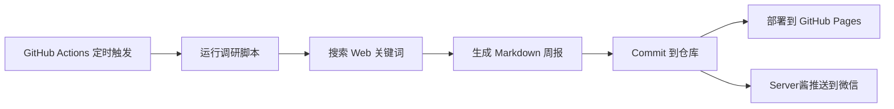

# 📡 免费API & 大模型情报周报

> 每周一自动调研免费API/大模型最新动态，生成周报并部署到 GitHub Pages。

## 工作原理



## 定期运行

- ⏰ **自动**: 每周一 UTC 0:00（北京时间 08:00）
- 👆 **手动**: 在 GitHub Actions 页面点击 `Run workflow`

## 查看报告

👉 https://liuruchuan.github.io/api-weekly-reports/

报告文件命名格式: `YYYY-MM-DD-API周报.md`

## 配置

### Server酱通知（可选）

如需微信推送通知，在 GitHub 仓库 Settings → Secrets and variables → Actions 中添加：

| Name | Value |
|------|-------|
| `SERVERCHAN_SENDKEY` | 你的 Server酱 SendKey |

## 开发

```bash
pip install -r requirements.txt
python scripts/research.py
```
